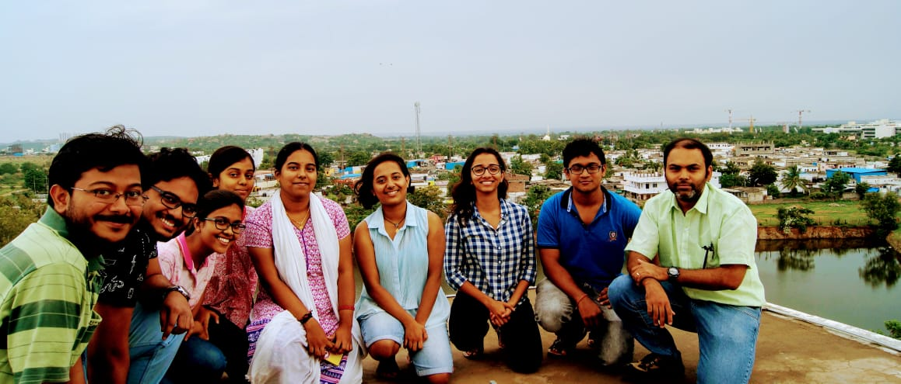
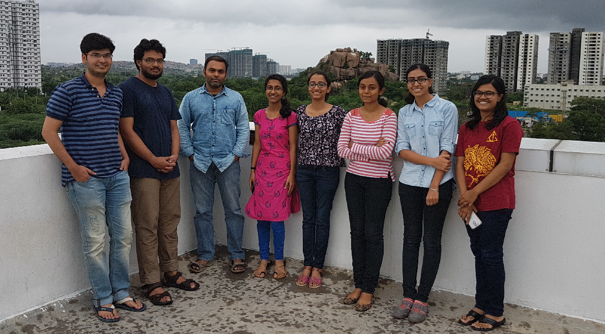
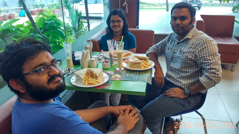

## Members

[Raghunathan Ramakrishnan](https://scholar.google.com/citations?user=jSCGozoAAAAJ&hl=en) 

### Junior Researchers
[Sabyasachi Chakraborty](https://scholar.google.com/citations?user=SQsR-gYAAAAJ&hl=en)              
Saurabh Chandra Kandpal           
Susmita Tripathy       
[Sai Vijay Mocherla](https://vijaymocherla.github.io/)      

### Alumni
[Prakriti Kayastha](https://scholar.google.com/citations?user=XIU5zG4AAAAJ&hl=en)      
– B.Sc. in Physics, Shiv Nadar University, Noida, India      
– (2017 VSRP fellow with us)      
– (June 2018 – May 2020, Junior Research Fellow with us)      
– (May 2020 – September 2021, Senior Research Fellow with us)      
– Since October 2021, Doctoral student at the Department of Mathematics, Physics and Electrical Engineering, Northumbria University, UK.      

[Salini Senthil](https://scholar.google.com/citations?user=gQqXsJAAAAAJ&hl=en)      
– B.Tech in Electrochemistry, Central Electrochemical Research Institute, Karaikudi, India      
– (2017 VSRP fellow with us)      
– (June 2018 – May 2020, Junior Research Fellow with us)      
– (May 2020 – September 2021, Senior Research Fellow with us)      
– Since October 2021, in Industry (R&D sector)      

[Amit Gupta](https://scholar.google.com/citations?user=PMsv6NAAAAAJ&hl=en)      
– Ph.D. in Chemistry, Indian Institute of Science, Bangalore, India      
– (August 2018 – July 2021, Research Associate with us)      
– Since August 2021, Research Associate at the University of Minnesota, USA      

Sambit Kumar Das      
– M.Sc. in Chemistry, Indian Institute of Technology Bhubaneswar, India      
– (July 2018 – June 2020, Junior Research Fellow with us)      
– (July 2020 – February 2021, Senior Research Fellow with us)      
– Since April 2021, Doctoral student at the Department of Physics, Stockholm University, Sweden      

[Rutvij Vihang Bhavsar](https://scholar.google.com/citations?hl=en&user=B6A0YUwAAAAJ)      
– M.Sc. in Physics, Indian Institute of Technology Kanpur, India      
– (2016 VSRP fellow with us)      
– (October 2018 – September 2019, Junior Research Fellow with us)      
– Since October 2019, Doctoral student at the Department of Mathematics, University of York, UK      

### Former Visiting Students      
[Ahana Ghosh](https://scholar.google.com/citations?user=82ubzWoAAAAJ&hl=en&oi=ao), 2016      
Manvi Gupta, 2017      
Anjana R Kammath, 2017      
Rishabh Gupta, 2017      
Sharanya Srinivasan, 2018      
Sowmya Krishnan, 2018      
Divya Suman, 2018      
Merlyn Baby, 2018      
Jaslin Kaur, 2019      
Rukhsar Chougle, 2019      

